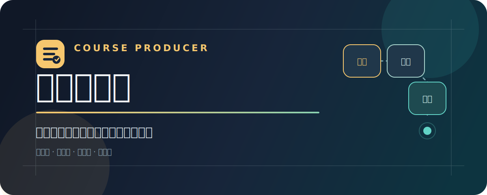

<div align="center">



<br>

[](https://github.com/Ivor-NCUT/course-producer/actions/workflows/validate.yml)
[](https://github.com/Ivor-NCUT/course-producer/releases/latest)
[](https://nodejs.org/)
[](https://agentskills.io/)
[](LICENSE)

**给 Codex 的课程生产系统。** 读取本地文件、飞书文档、妙记转录和已有课程稿，持续加工为课程定位、专家访谈、知识卡、成果优先课纲、逐章逐字稿、审校稿、飞书协作文档与海报方案。

[快速开始](#-三分钟开始) · [看看效果](#-它会把什么变成什么) · [生产流程](#-一条可以断点续跑的生产线) · [完整教程](docs/tutorial.md) · [下载最新版](https://github.com/Ivor-NCUT/course-producer/releases/latest)

</div>

---

## ✨ 它会把什么变成什么

<table>
<tr>
<td width="50%" valign="top">

### 你手里的材料

- 几小时的访谈录音或飞书妙记
- Word、PDF、旧课纲和零散笔记
- 写了一半、风格不统一的课程稿
- 散落在本地与飞书里的反馈和评论

</td>
<td width="50%" valign="top">

### 可以继续协作的课程项目

- 清楚的课程定位与学员成果
- 带来源位置的知识卡和案例
- 能独立交付结果的课纲与逐字稿
- 审校记录、飞书正式稿和海报方案

</td>
</tr>
</table>

它会把进度写进项目目录。任务中断后，下一次先核对真实文件，再从第一个未完成阶段继续；已经确认的内容不会被悄悄覆盖。

```text
你：课程制作人，读取 /Projects/AI-sales-course 里的全部材料，
    先建立项目状态，再连续完成定位、知识萃取、课纲、逐字稿和审校。
    没有来源的数字与案例保留待确认。

课程制作人：已登记 8 项可读材料，1 项缺少权限，2 段会议闲聊已排除。
            当前材料足够完成定位和前两模块课纲；完整成交案例仍需补访谈。
            下一步将生成带来源的知识卡，并记录缺口，不阻塞其余章节。
```

## 🚀 三分钟开始

需要 Node.js 20 或更高版本。完整课程生产不依赖远程数据库，也不需要自建 Agent 后端。

```bash
gh repo clone Ivor-NCUT/course-producer
cd course-producer
node tools/validate-skills.mjs
node tools/install.mjs
```

安装完成后，在 Codex 中直接说：

```text
课程制作人，读取这个目录里的课程素材，建立项目状态并持续做成一门完整课程。
```

也可以让 Agent 代为安装：

```text
请安装并验证这个课程制作 Skill：https://github.com/Ivor-NCUT/course-producer
```

不想克隆仓库时，可前往 [Releases](https://github.com/Ivor-NCUT/course-producer/releases/latest) 下载完整套件或单个 Skill 压缩包。

> [!NOTE]
> 飞书材料读取与交付需要已经安装并授权的 `lark-cli` 及对应 Lark Skills；海报画板还需要 `beautiful-feishu-whiteboard`。这些能力不可用时，本地生产链仍可运行，相关写入会明确停在阻塞项。

## 🧭 一条可以断点续跑的生产线

```text
🗂 材料摄取  →  🎯 课程定位  →  🎙 专家访谈  →  🧠 知识萃取
                                                     ↓
🚀 飞书交付  ←  🔎 课程审校  ←  ✍️ 分章逐字稿  ←  🧭 成果课纲
      │                                      │
      └── 🎨 海报方案                🧪 试讲与迭代 ↺
```

主路由负责识别任务模式、恢复进度和检查完成度，11 个原子 Skill 各自守住一个职责边界。

| 阶段 | 它具体做什么 | 留下什么 |
|---|---|---|
| 材料摄取 | 盘点文件与飞书来源，区分课程证据、指令和闲聊 | `materials.jsonl`、缺口报告 |
| 定位与访谈 | 明确学员、场景、成果和约束，只追问会改变结果的问题 | 定位稿、动态访谈提纲 |
| 知识与课纲 | 提取带来源的知识卡，让最着急的学员先拿到成果 | 知识卡、成果优先课纲 |
| 写作与审校 | 分章写可讲、可录、可审的稿件，检查事实与口播节奏 | 逐字稿、`review.jsonl` |
| 交付与迭代 | 写入飞书、生成海报方案，用试讲证据决定下一版改什么 | 协作文档、海报方案、版本决定 |

## 🧩 12 个可以独立调用的 Agent Skills

| Skill | 中文能力 | 适合什么时候单独用 |
|---|---|---|
| `course-producer` | 课程制作人 | 从材料开始跑完整流程，或恢复上次项目 |
| `course-material-intake` | 课程材料摄取 | 先弄清楚有哪些材料、哪些能用 |
| `course-positioning` | 课程定位 | 明确给谁学、解决什么、交付什么结果 |
| `course-interview-design` | 专家访谈设计 | 根据材料缺口补问行业专家 |
| `course-knowledge-extraction` | 课程知识萃取 | 从转录与文件中提炼可追溯知识卡 |
| `course-outline-design` | 成果优先课纲 | 把知识目录改成学员成果路径 |
| `course-lesson-writing` | 课程逐字稿 | 按章节写可讲、可录、可审的正式稿 |
| `course-quality-editor` | 课程审校 | 检查逻辑、证据、节奏和 AI 写作坏味道 |
| `course-lark-delivery` | 飞书课程交付 | 创建正式稿、回读验证、添加局部评论 |
| `course-poster-planning` | 课程海报方案 | 产出有证据的海报策略和可编辑原型 |
| `course-aesthetic-alignment` | 课程审美对齐 | 从真实改稿中提炼并验证项目级偏好 |
| `course-pilot-iteration` | 课程试讲迭代 | 用作业、访谈和行为证据验证教学假设 |

```text
课程制作人，只检查这十章的逻辑、事实证据和 AI 写作坏味道，不改变讲师立场。

课程制作人，根据完整课程设计招生海报；缺失的价格和案例先保留待补位置。

课程制作人，继续上次的课程项目，从第一个未完成阶段开始。
```

## 📦 每个项目都有一份可追溯状态

```text
.course-producer/
├── project.json                 # 项目身份与配置
├── state.json                   # 阶段、验证结果、阻塞项和下一步
├── materials.jsonl             # 材料来源、指纹、状态和证据位置
├── decisions.jsonl             # 真正需要人决定的问题
├── preferences/                # 已验证的项目级审美偏好
└── artifacts/
    ├── positioning.md          # 课程定位
    ├── interview-guide.md      # 专家访谈提纲
    ├── knowledge-cards.jsonl   # 带来源的知识卡
    ├── course-blueprint.md     # 成果优先课纲
    ├── lessons/                # 逐章课程稿
    └── review.jsonl            # 审校记录
```

状态工具：

```bash
node tools/course-project.mjs --root /path/to/course init --name "课程名称"
node tools/course-project.mjs --root /path/to/course status
node tools/course-project.mjs --root /path/to/course resume
node tools/course-project.mjs --root /path/to/course verify --require-complete
```

<details>
<summary><b>查看设计约束与安全边界</b></summary>

<br>

- 阶段完成必须同时登记真实产物、输入指纹和验证结果。
- CLI 会拒绝非法状态迁移，也会阻止已确认产物被静默替换。
- 事实、数字、案例、背书和讲师原话必须能回到来源；证据不足时保留待确认。
- 客户材料与项目级偏好默认留在用户项目，不会写进通用知识库。
- 飞书写入、公开发布和覆盖真实文档仍受授权与确认门禁约束。
- 海报 Skill 交付策略与可编辑原型，不代替设计师制作最终商业成片。

</details>

## 🧪 验证与构建

仓库的校验、测试和打包均使用 Node.js 标准库；GitHub Actions 还会用 Python 3.12 进行 Skill 快速校验。

```bash
node tools/validate-skills.mjs
node tools/validate-evals.mjs
node --test tests/*.test.mjs
node tools/run-offline-sample.mjs --output dist/offline-sample
node tools/build.mjs
```

构建结果包括：

- `dist/course-producer-suite.zip`：完整套件；
- `dist/skills/*.zip`：主路由和每个原子 Skill 的独立包；
- `dist/build-manifest.json`：文件数量与解压校验结果。

离线样例检查核心阶段、检查点和必需产物，不冒充模型内容质量评测；内容行为由 [`evals/`](evals/) 中的场景和断言覆盖。

## 🗺️ 仓库导航

```text
skills/          主路由与单一职责原子 Skills
知识库/           方法论、模板、词典和原创 atoms.jsonl
tools/           状态、审校、校验、安装、样例与构建工具
tests/           状态机、审校与离线端到端测试
evals/           从零做课、材料做课、已有稿精修等场景
examples/        可公开的离线协议样例
docs/            教程、架构、来源和许可边界
```

- 想直接使用：读 [完整中文教程](docs/tutorial.md)
- 想理解设计：读 [架构契约](docs/architecture.md)
- 想核对来源：读 [源能力迁移清单](docs/source-capability-map.md)
- 想确认授权边界：读 [许可和来源边界](docs/licensing-and-provenance.md)

## 📚 来源与许可

本项目研究了 [dontbesilent2025/dbskill](https://github.com/dontbesilent2025/dbskill) 的“主路由 + 原子 Skill + 文件型知识库”架构，以及目标验收、问题约束、知识版本治理和反馈回流等通用问题。课程规则均面向课程场景原创重写，不复制其 CC BY-NC 4.0 内容、代码或知识原子。完整说明见 [许可和来源边界](docs/licensing-and-provenance.md)。

Course Producer 自有代码与原创文档采用 [MIT License](LICENSE)。外部工具、用户材料与引用内容仍遵循各自许可和授权边界。

---

<div align="center">

如果它帮你把一堆散落材料真正做成了课，欢迎点一颗 ⭐。<br>
遇到问题或有改进想法，可以直接提交 [Issue](https://github.com/Ivor-NCUT/course-producer/issues)。

</div>
